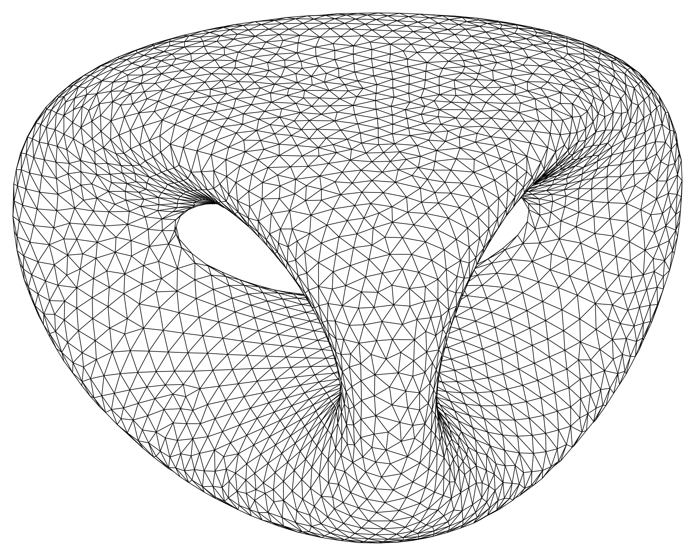

# Representação Implícita

   

$$2y(y^{2}-3x^{2})(1-z^{2})+(x^{2}+y^{2})^{2}-(9z^{2}-1)(1-z^{2})=0$$

<!-- _footer: image by Ag2gaeh - Own work, CC BY-SA 4.0, https://commons.wikimedia.org/w/index.php?curid=45255076 -->

---