

<!-- _paginate: false -->
<!-- _class: invert -->

# Representação Implícita de Sinais em Redes Neurais para Compressão e Multirresolução

## Teoria da Informação - IMPA 2021

### Hallison Paz

<!-- _footer: Esta apresentação se baseia em uma **pesquisa em curso** -->

---

# Teorema da Separação Fonte Canal 

> Da aula 13:

1. Mapeie o sinal diretamente aos possíveis valores a serem transmitidos
2. Mapeie o sinal primeiro a uma representação mais eficiente. Depois use esta representação para ser mapeada a valores a serem transmitidos.

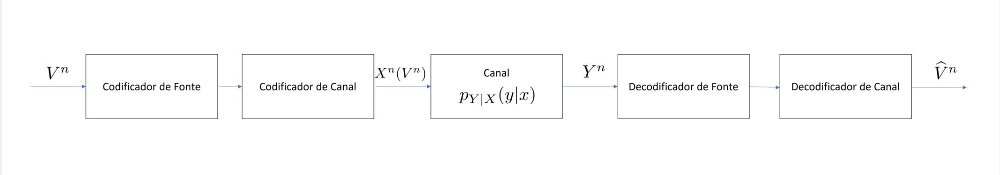

---

# Exemplo 
# JPEG

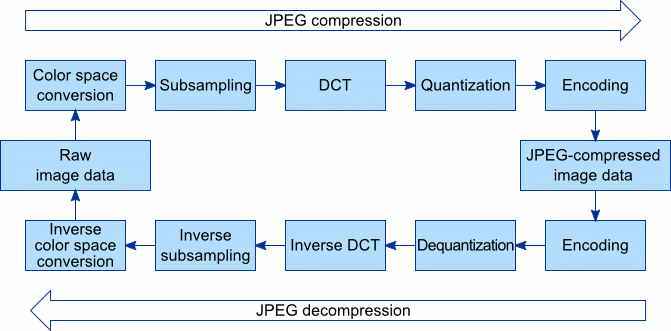

---

# O que queremos?

- Codificar sinais contínuos
* Preferencialmente: 
  * Usando menos espaço 
  * Com qualidade adequada a múltiplas aplicações

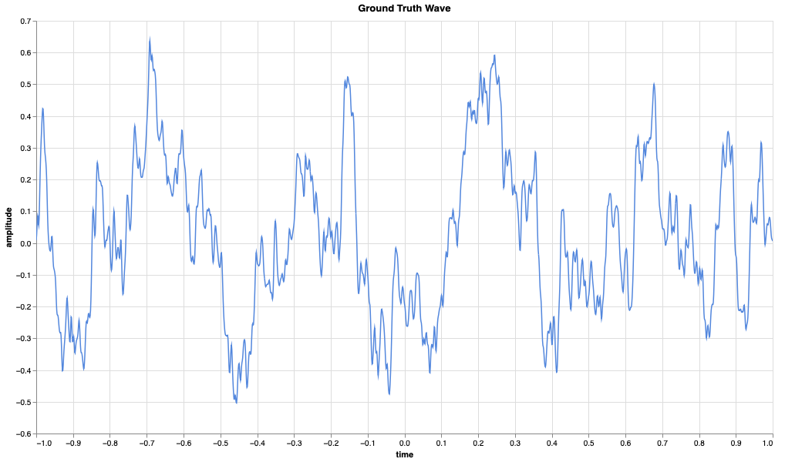

---

# O que sabemos?

- A princípio, funções contínuas têm infinitos graus de liberdade
* Precisamos representar e transmitir quantidades finitas
* Discretização da imagem: **quantização**
* Discretização do domínio: **amostragem**

---

# Amostragem Pontual Regular

- Teorema de amostragem de Nyquist-Shannon (aula 17)

> "Suponha que uma função $f(t)$ é limitada em banda a $W$, ou seja, se o
> espectro de $f$ é 0 para frequências maiores que $W$. Então a função  é
> completamente determinada por amostras espaçadas $\frac{1}{2W}$ segundos."

---

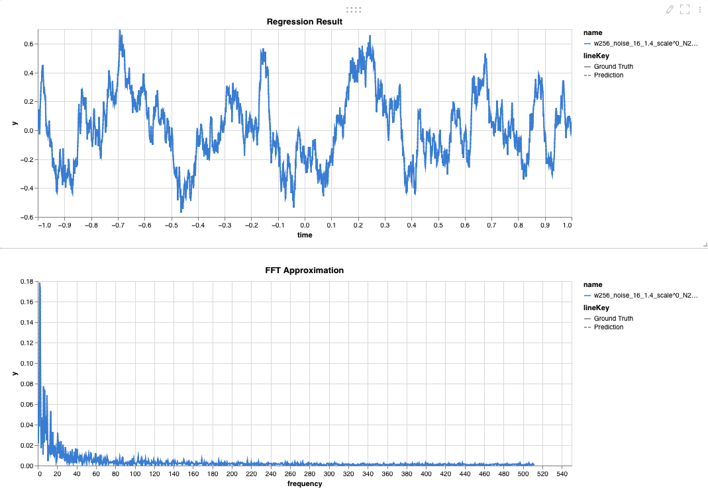

---
### Amostragem Pontual Regular

 

- Função pente ($comb$)
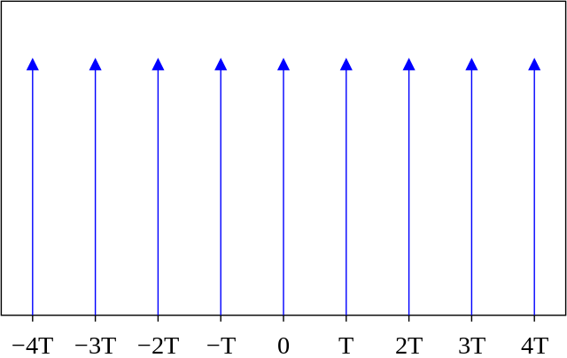

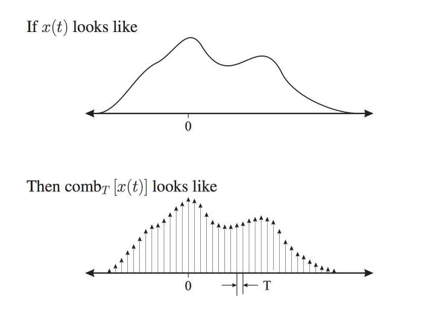

---
# Reconstrução exata

- Se atendermos ao limite de Nyquist, podemos reconstruir o sinal usando a função $sinc$
* Na prática, há diversas questões a se tratar, pois sinais de banda limitada teriam suporte infinito.

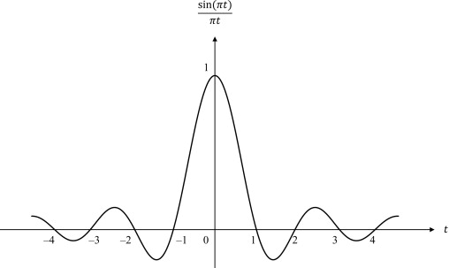

---

# Amostragem e Reconstrução

- [Wolfram Demonstrations Project](https://demonstrations.wolfram.com/SincInterpolationForSignalReconstruction/)

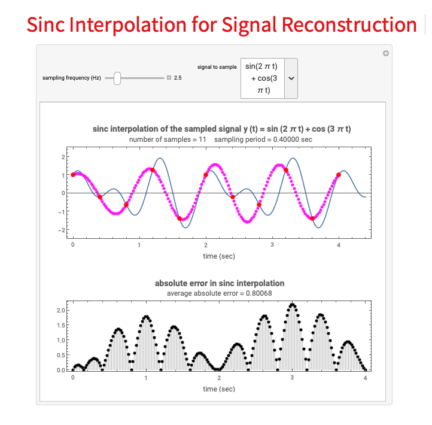

<!--  -->
---

# Imagens são sinais 2D

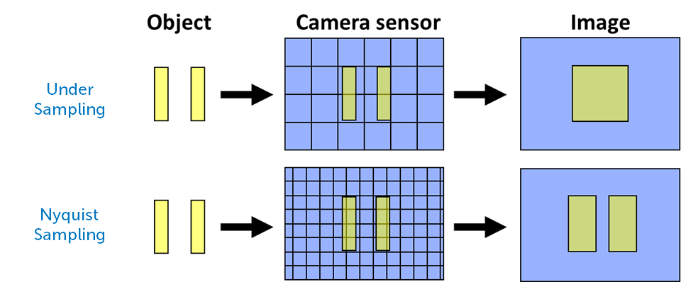
▶️ Saiba mais em [Amostragem e Reconstrução de Imagens](https://youtu.be/E8PJDhwy_RI)

<!-- _footer: Image from https://www.photometrics.com/learn/camera-basics/camera-resolution -->

---

# Superfícies são sinais 3D

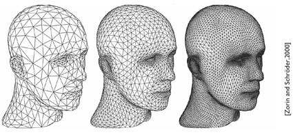

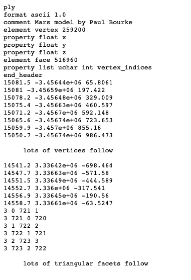

- **Malha poligonal**: milhares/milhões de pontos
-  Resolução fixa na amostragem
▶️ Saiba mais em [Modelagel 3D da Terra](https://youtu.be/6RXmgUgB-AU)

<!-- _footer: Ply file example from [Paul Bourke](http://paulbourke.net/dataformats/ply/example1.ply) -->

---

<!-- _paginate: false -->

# Não é possível ter uma representação contínua e compacta?!

---

<!-- _class: invert -->
<!-- _paginate: false -->

# Representação Implícita!

---

# Representação Implícita

- Imagem inversa de um valor regular de um campo escalar (Teorema da Função Implícita)
* **Exemplo**:
Função Distância com Sinal
* Superfície de nível 0

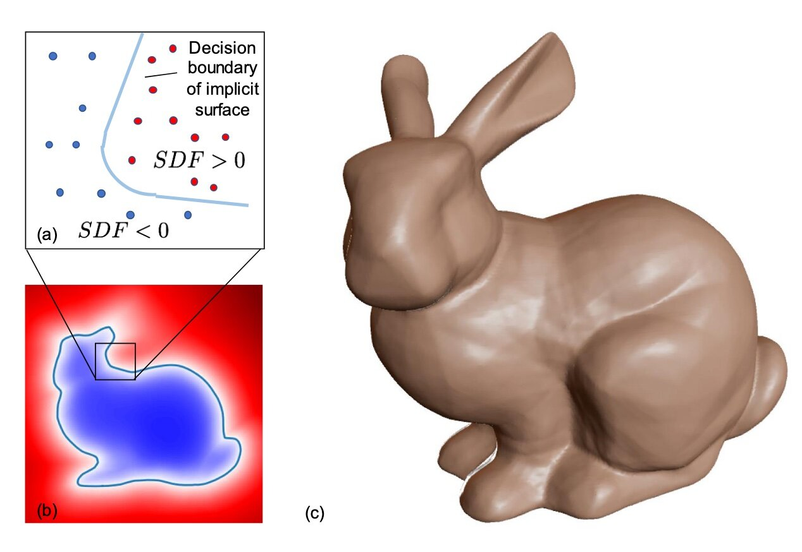

---

<!-- _class: invert -->
<!-- _paginate: false -->

# Representação em Rede Neural

---

# Rede Neural

- Aproximador Universal
- Modelo **paramétrico** para funções **contínuas**.

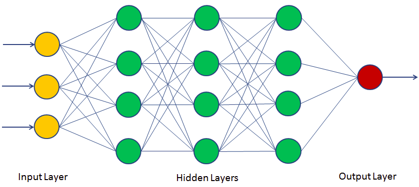

<!-- _footer: Hornik, Kurt; Tinchcombe, Maxwell; White, Halbert (1989). \n [Multilayer Feedforward Networks are Universal Approximators](https://cognitivemedium.com/magic_paper/assets/Hornik.pdf). Neural Networks. 2. Pergamon Press. pp. 359–366. -->

---

# Rede Neural

### Perceptron (neurônio artificial)

- Produto interno entre pesos (parâmetros) e entrada
- Não linearidade aplicada na saída
* Pesos podem ser ajustados por otimização

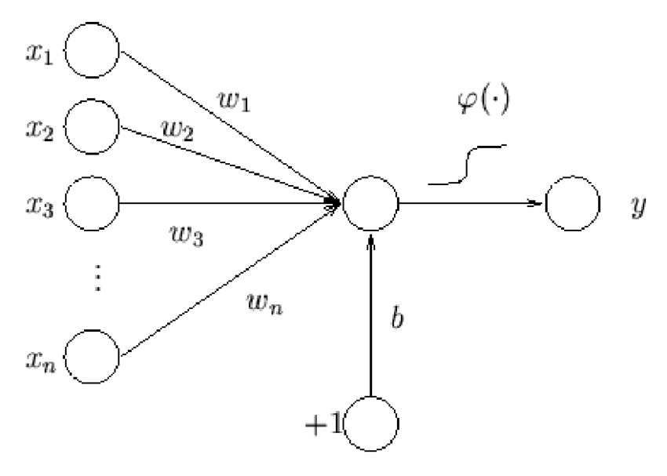

<!-- _footer: Saiba mais em [Introdução ao PyTorch | Redes Neurais](https://youtu.be/cGxv8tOaA7I) -->

---

<!-- _paginate: false -->
# Podemos representar sinais na rede, então?!

---
## Rede SIREN - senos como não linearidade

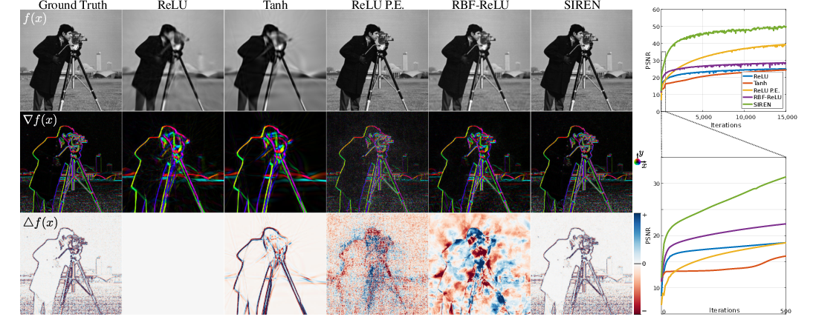

<!-- _footer: Sitzmann, Vincent & Martel, Julien & Bergman, Alexander & Lindell, David & Wetzstein, Gordon. (2020) \n [Implicit Neural Representations with Periodic Activation Functions](https://www.vincentsitzmann.com/siren/) -->

---

# Ajustando a rede a um sinal 1D

          

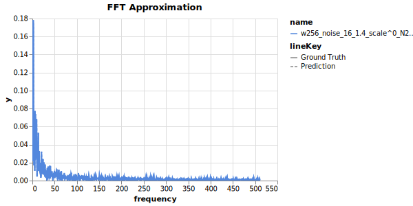

<!-- _footer: Ver gráficos no [Weights and Biases](https://wandb.ai/siren-song/multifilter-gaussian-pyramid/reports/Gaussian-Pyramid-Approximation--VmlldzoxMjU5NTUz?accessToken=d2da90j71mcptlhnrx7u0thy576r9lyr30bujgtxbr89sx01l8338i62jihhkg1u) -->
---

<!-- _class: invert -->
<!-- _paginate: false -->

# Compressão e Multiresolução

---
# Compressão e Multiresolução

- ~~Armazenar amostras~~ Armazenar os pesos da rede?
* Podemos solicitar o sinal em qualquer resolução
* Qual a arquitetura mínima necessária para representar o sinal? Como eliminar redundâncias?
* É possível aprender uma base não linear mais adaptada ao sinal e reduzir o número de amostras e parâmetros necessários? (*Compressed sensing?*)

---

# O que já aprendemos

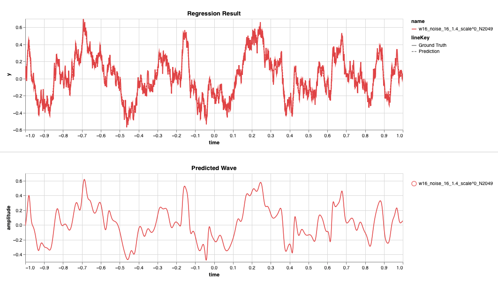

<!-- _footer: Ver gráficos no [Weights and Biases](https://wandb.ai/siren-song/multifilter-gaussian-pyramid/reports/Gaussian-Pyramid-Approximation--VmlldzoxMjU5NTUz?accessToken=d2da90j71mcptlhnrx7u0thy576r9lyr30bujgtxbr89sx01l8338i62jihhkg1u) -->

---

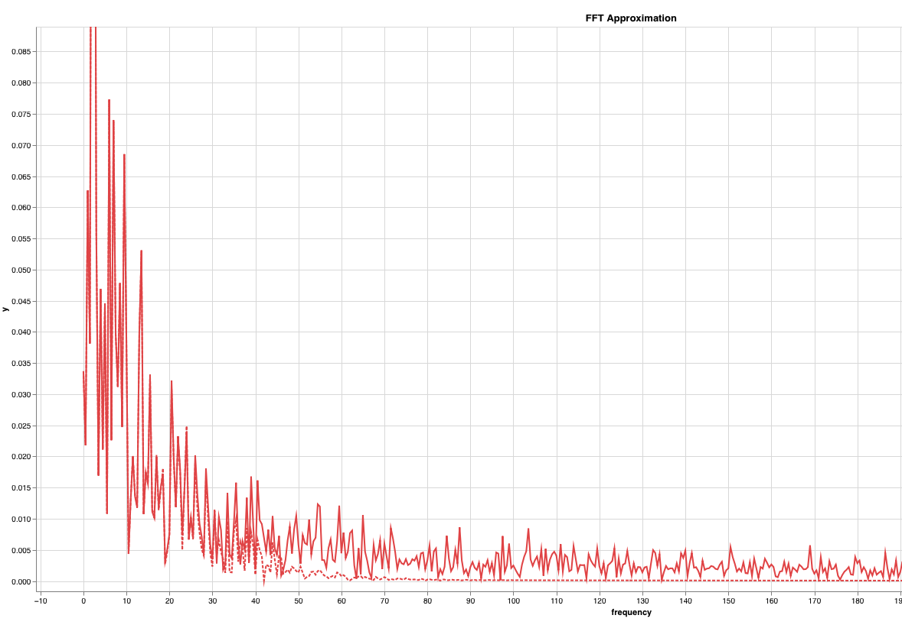

---

# O que queremos fazer?

- Uma nova arquitetura de rede
* Aprendizado por banda de frequência
* Análise em multiescala

---

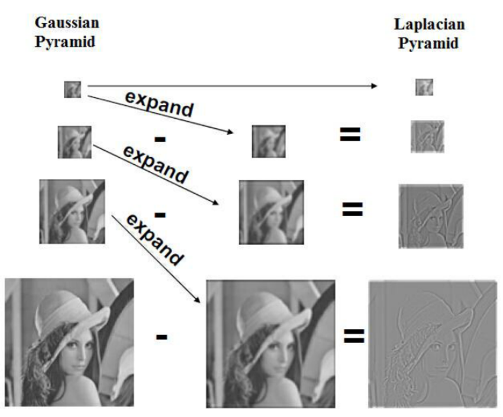

---

# Rede pode aprender as pirâmides?

- **Experimento em curso**: treinar com menos pontos, comparar com os pontos originais
* Como as frequências de inicialização filtram as bandas do sinal reconstruído? 
* Será que a rede aprende a pirâmide Laplaciana "sozinha"?
  * Transmitir e reconstruir o sinal das escalas mais grosseiras pras mais finas
  * Eliminar dados com baixo impacto perceptual

---

# Conclusão

- Redes neurais podem ser modelo interessante para codificação de fonte
* Estamos verificando a teoria de amostragem na prática
* Não há muita teoria para compreender as redes neurais; estamos aprendendo
* Pesquisa em andamento, mas resultados promissores

---
<!-- _class: invert -->
<!-- _paginate: false -->

# Obrigado!

### hallpaz@impa.br